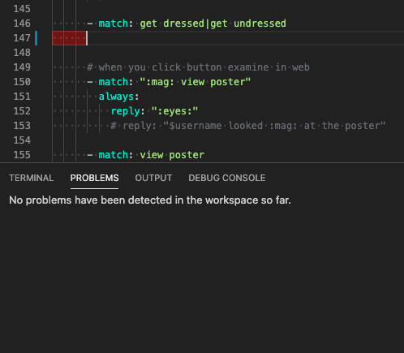

# Editing Files offline using github

There are a couple of ways to edit. Depending on how much you're editing:
- edit in github web pages
- sending zip files
- using git and edit offline

## in the github web
The quickest way would be to edit the files directly in github.
if it's just text changes you can edit in the browser directly, but its a bit clunky.
hassle here is you have to use the crappy browser to edit.
this is kind of like using google docs, but not a great web editor. it's only text files tho.
any changes you make are synced right away with me, so its low-risk in terms of going out of sync or two people edting files at the same time.

## zip files
or you could get a ZIP of the whole thing
from here:
https://github.com/dcsan/storydata
edit offline and send it back to me

ideally let me know when youre working on stuff so I would probably avoid any big changes while you're working.
then you can email me the zip and I'll deal with merging it.
this is like emailing me your latest version of a powerpoint.
hassle here is you have to send me zips and i have to mess around with merging every change, and risk of both editing the same files.

## Editing with Git
The sophisticated way that would allow us to work in parallel would be to edit using 'git'
it's actually much easier, kind of like dropbox or google drive.
Except that sync is not automatic, you have to "push" your changes when done.

it's a bit more setup (not that much really) but makes it much smoother as a workflow.

each change you just "push" to the repo and then developers and others get it and can merge and check it.
no manual sending zip files around (this is like using google docs vs. attaching a powerpoint by email)

You can also use powerful local apps to check your edits as you type.

# Editing using a github account

## Create free Github account
- If you don't have one, create a github account at https://github.com/
- Let one of us know your github user ID and we'll add you to this project.
- Download github desktop https://desktop.github.com/
- Download VS Code here https://code.visualstudio.com/download \
We strongly recommend the excellent and free VS Code editor for yaml script files.

## Clone the github repository
Here I'm using the github desktop app

- make a clone of the "repository" onto your local machine \
  - The repo URL is `git@github.com:dcsan/storydata.git`

- Make a personal branch \
This keeps your work separate until you're ready to "merge" with everyone else's changes.

## Make your edits

- Edit and make changes locally \
You can "open in VS code"

- commit your changes \
A short message helps people know what was changed

- "push" your changes to the central repo \
At this point your changes are in github.com but in your own personal branch.

more info on formatting docs [is here](yaml-editing.md).

## Make a "Pull Request"
You can send a message to us to notify, but githb.com has a feature called a "Pull Request" (PR) for this.

Go here:
https://github.com/dcsan/storydata/pulls

You should see your name highlighted at top, to make a new PR

Or here if it doesn't show:
https://github.com/dcsan/storydata/compare

- choose your branch \
here you can see all the changes you made.

- Create the PR
- Ask for reviewers \
This should notify people of your new PR

You can also click the `files changed` tab to review all your changes.

If you're confident about all the changes you could just go ahead and "Merge Pull Request", or wait for someone else to review.

[Learn more about pull requests here](https://docs.github.com/en/github/collaborating-with-issues-and-pull-requests/about-pull-requests)

At this point someone will check your changes, and merge into the "master" branch and then we can publish a new version of the Bot!

Another reason for doing PRs is to check for conflicts. If you're working on a story and both of you edit the same file at the same time, often Github can just "merge" these changes. But sometimes if you edit eg the exact same line, github will flag this as a conflict, so you have to manually fix this before merging. This is a whole topic to itself though.

### Editing Hints

VS code has a number of 'plugins' to make editing more convenient.
Please install the redhat YAML plugin:

https://marketplace.visualstudio.com/items?itemName=redhat.vscode-yaml

Now editing `story.yaml` will show you errors when editing:

- [more info on formatting docs](yaml-editing.md).

### VS Code and github
Microsoft owns both VSCode and Github, so there are excellent tools within VSCode for managing the github changes.
