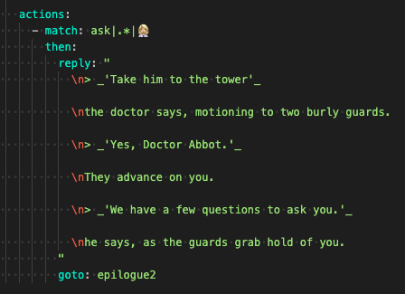

## Markdown / YAML details

There are some oddities when editing markdown code inside YAML files.
- [YAML](https://blog.stackpath.com/yaml/) is the format with this odd indents etc we're using
- [Markdown](https://www.markdownguide.org/getting-started/) is the formatting for italics, newlines etc.

## Quotes
Enclosing the whole text in double quotes `"..."` allows you to have something broken over multiple lines.
You cannot enclose in single quotes `'...'`, I'm not quite sure what the difference is.
Generally single quotes means "no funny business inside the quote"

If you want to have quotes inside the quotes then use inner single quotes.

So you would have:  `"he said: 'something' "`
You can also use “curly quotes” but I don't as I forgot how to type them in my code editor.

Mac OSX
- Alt + ] produces an opening single curly quote ( ' )
- Alt + Shift + ] produces a closing single curly quote ( ' )
- Alt + [ produces an opening double curly quote ( “ )
- Alt + Shift + [ produces a closing double curly quote ( ” )

If you really want double quotes inside you can 'escape' them by preceding with a backslash.
eg `" then she said \"something\" "`. But that quickly gets confusing and error prone.
Stick to outer double quotes and inner single quotes.

To indent text like a quote put a `>` as the first character on the line.

For italics use `_underscore_` on _both_ sides.

To add newlines use a `\n`. This can be anywhere but it's better to group them together ie always at the start or end of lines.

Note that the extra empty lines just get eaten up, but adding in the `\n` will space them out.

Note also that putting `\n` at the end of a line works, but I've had problems with the `>` on the next line being recognized, so I put them together now like `\n> `
If you want italics and quotes, you need to leave a space after the `>`
so you end up with `\n> _'Yes Doctor' he said`

markdown without extra `\n` newlines:

result:

adding in some newlines:

Some more notes on Discord formatting:

https://discohook.org/

